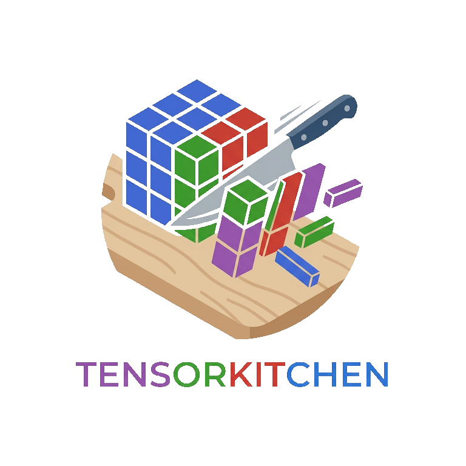

# TensorKitchen.jl: tensor decompositions in Julia

```@raw html

```

TensorKitchen.jl provides practical tensor decompositions with a consistent
Julia interface. Give it a numerical array and a target rank, then inspect the
compact result or reconstruct an approximation of the original tensor.

## Installation

Install TensorKitchen from the Julia package manager:

```julia
using Pkg
Pkg.add("TensorKitchen")
```

## Quick start

```julia
using TensorKitchen

A = randn(20, 15, 10)
result = tucker(A, (5, 4, 3))

compressed = core(result)
A_approx = reconstruct(result)
error = rel_error(A, result)
```

`A_approx` has the same dimensions as `A`. A smaller `error` means that the
reconstruction is closer to the input tensor.

## Choose a decomposition

| Goal | Function | Result |
| --- | --- | --- |
| Represent a tensor with shared rank-one components | [`cpd`](@ref) | `CPDResult` |
| Require nonnegative CP components | [`nncpd`](@ref) | `CPDResult` |
| Compress every tensor mode into a smaller core | [`tucker`](@ref) | `TuckerResult` |
| Represent a tensor as a sum of Tucker blocks | [`btd`](@ref) | `BTDResult` |
| Build a custom sum of manifold components | [`approx`](@ref) | `ApproxResult` or a specialized result |

See [Choosing a decomposition](PIPELINE.md) for a longer comparison.

## Guides

- [CP decomposition](cpd.md)
- [Tucker decomposition](tucker.md)
- [Block term decomposition](btd.md)
- [Join decomposition](join.md)
- [Saving and loading results](utils.md)
- [Advanced methods](advanced/index.md)
- [References](references.md)
