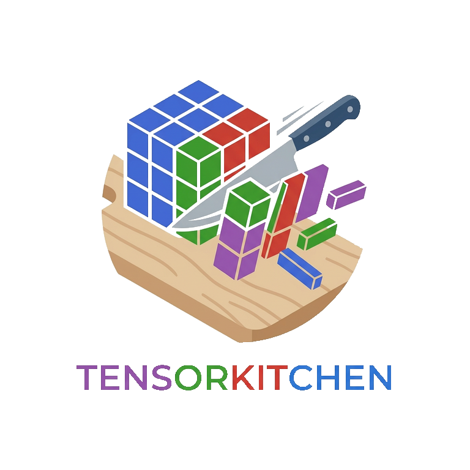

# TensorKitchen.jl: tensor decompositions in Julia

```@raw html

```

**TensorKitchen.jl** is a Julia package for tensor decompositions.

* [CPD documentation](cpd.md)
* [Tucker documentation](tucker.md)
* [BTD documentation](btd.md)
* [Join decomposition documentation](join.md)
* [Utilities](utils.md)
* [Pipeline](PIPELINE.md)
* [References](references.md)

## Notes 

The package is currently an early version and will be updated frequently in the near future.

The implementation is based on combining algebraic algorithms like ALS (see, e.g., the [textbook by Kolda and Ballard](https://users.wfu.edu/ballard/pdfs/tensor_textbook.pdf)) and Riemannian optimization from [Manopt.jl](https://manoptjl.org/stable/).

What currently works is 

- Canonical Polyadic Decomposition (CPD)
- Tucker Decomposition
- Nonnegative Canonical Polyadic Decomposition (NNCPD)
- Block Term Decomposition (BTD)
- Join Decompositions
---

The next updates will include 

- Handling of swamps/plateaus in the optimization step
- Documentation
- Improved User Interface
- GPU Support 
- LL1 Decomposition (3-way specialized BTD)
- Symmetric CP / Waring Decomposition
- Partially Symmetric CP
- Tensor Trains
